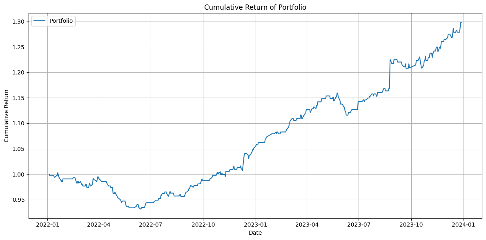
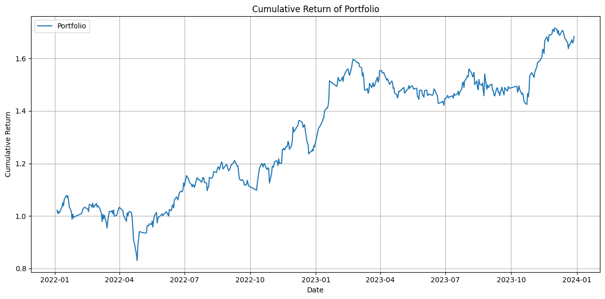
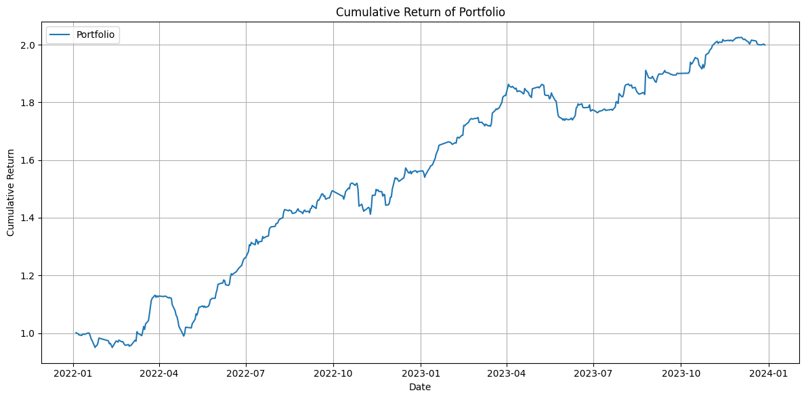

# 📈 高频阿尔法因子研究

本项目包含三个基于中国 A 股市场的**分钟级**与**集合竞价时段**数据构造的阿尔法因子。每个因子对应不同的信号生成时点与持仓周期，旨在挖掘短周期内的价格行为特征与交易结构性机会。

> 所有因子的收益率曲线均基于如下策略构建：**首先将全市场股票按当日因子值进行横截面排序并分组，
然后通过历史回测选定长期表现最优的一组作为固定投资组合，
在整个测试期内每日等权买入该组股票，进行收益统计。**。

---

## 🔍 因子一：盘中价差稳定性因子（Spread Volatility Ratio）

**计算公式：**

```
mean(high - low) / std(high - low)
```

即：分钟级 high - low 的均值与标准差之比。

**设计逻辑：**

衡量股票在日内的价差波动是否稳定。若价差大但波动小，可能暗示流动性隐含或稳步建仓行为。

**使用方式：**

- 数据来源：当日的分钟级 K 线（High / Low）
- 信号时点：每日收盘前生成
- 交易逻辑：收盘买入，次日开盘卖出
- 预测目标：隔夜收益率（close-to-open）
- 实测夏普比率：**1.805**

---

## ⚖️ 因子二：集合竞价 VWAP 失衡因子（Pre-market VWAP Imbalance）

**计算公式：**

```
(buy_vwap - match_price) / (match_price - sell_vwap)
```

其中：
- buy_vwap：集合竞价期间买方成交 VWAP
- sell_vwap：集合竞价期间卖方成交 VWAP
- match_price：集合竞价撮合价

**设计逻辑：**

集合竞价阶段（如 9:15–9:25）中，若买方成交均价高于撮合价，而卖方成交均价低于撮合价，说明买方更激进，该因子度量这种买卖力量的不对称性。（在测试这个因子之前我也尝试过 9:20 的最佳撮合价与买/卖方成交挂单均价的比较，但效果不如 9:25 的好，究其原因可能是 9:20 之前的集合竞价期间允许撤单因此存在更多的噪音，而 9:20 之后不允许撤单，因而噪音含量相对较低）

**使用方式：**

- 数据来源：集合竞价挂单与撮合数据
- 信号时点：开盘前可获取
- 交易逻辑：开盘买入，次日开盘卖出 
- 预测目标：open-to-next_open 收益率
- 实测夏普比率：**1.245**

*注：由于集合竞价的成交价格即为开盘价，我们很难保证以开盘价成交，这一部分可以视为滑点，理想状态下仍希望以开盘价购入。同时我也测试了开盘后一分钟买入并持仓到第二日开盘，结果仍然比较可观。*

---

## 🧪 因子三：VWAP 扩张指数因子（VWAP Expansion via Exponentiation）

**计算公式：**

```
(high - vwap) ** (vwap - low)
```

**设计逻辑：**

最初将 `(high - vwap)` 与 `(vwap - low)` 相乘，但效果一般。后来尝试用幂函数形式放大两者共振情况，能更敏感地捕捉极端价格扩张，因子表现显著提升。

**使用方式：**

- 数据来源：当日分钟级 high、low、vwap
- 信号时点：每日收盘前生成
- 交易逻辑：收盘买入，次日开盘卖出
- 预测目标：隔夜收益率（close-to-open）
- 实测夏普比率：**1.865**

---

📉 因子间相关性分析
为检验三个因子是否表达了不同的市场信息，计算了它们在所有（股票，交易日）样本上的整体 Pearson 相关系数矩阵。结果如下：

## 📊 因子表现汇总

| 因子名称                   | 信号类型       | 持仓周期             | 夏普比率 |
|----------------------------|----------------|----------------------|----------|
| 盘中价差稳定性因子        | 分钟级盘中信号 | 收盘买入 → 次日开盘 | 1.805    |
| 集合竞价 VWAP 失衡因子     | 集合竞价信号   | 开盘买入 → 次日开盘 | 1.245    |
| VWAP 扩张指数因子          | 分钟级盘中信号 | 收盘买入 → 次日开盘 | 1.865    |

---

## 📈 收益率曲线展示

> 横轴为交易日，纵轴为组合累计净值，所有收益率基于等权重持有每日因子排名最高的股票组。

### 因子一：盘中价差稳定性因子（Sharpe = 1.805）



---

### 因子二：集合竞价 VWAP 失衡因子（Sharpe = 1.245）



---

### 因子三：VWAP 扩张指数因子（Sharpe = 1.865）



---

## 🗂️ 项目结构说明

- `factor1.ipynb`：因子一实现代码（Spread Volatility Ratio）
- `factor2.ipynb`：因子二实现代码（Auction VWAP Imbalance）
- `factor3.ipynb`：因子三实现代码（VWAP Expansion via Power）
- `helpers.py`：可能会用到的工具函数
- `images/`：包含三张因子收益率曲线图片
- `README.md`：因子逻辑、使用方式与性能总结说明文档

---

## 📌 附注说明

- 所有因子均无未来函数或数据泄露，已验证不含前视偏差
- 因子逻辑适用于日频调仓的短期策略，可进一步组合成多因子选股模型
- 建议结合横截面标准化、中性化与风险调整收益优化策略提升实盘表现
